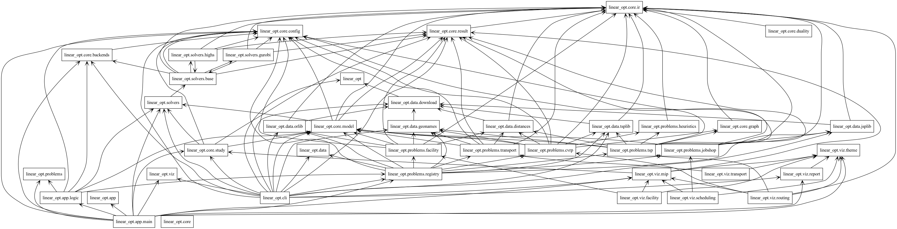

# LiMilpOptKit: Linear and mixed-integer optimization Toolkit in Python

[](https://github.com/aadinoyiibrahim/linear_opt/actions/workflows/ci.yml)
[](https://aadinoyiibrahim.github.io/linear_opt/)


- **Gurobi** is the primary solver;
- **HiGHS** is an open-source fallback,
so everything also runs without a commercial licence. Models are solved on real benchmark data, checked independently of the solver, and explored through interactive Plotly reports and a Streamlit dashboard.

| Problem | Class | Data |
|---|---|---|
| Transport / optimal transport | LP | German cities (GeoNames), synthetic |
| Capacitated facility location | MILP | OR-Library cap41–cap134, German cities, synthetic |
| Travelling salesman | MILP + lazy cuts | TSPLIB (berlin52, …), German cities, synthetic |
| Vehicle routing (CVRP) | MILP + lazy cuts | CVRPLIB A-n32-k5, German cities, synthetic |
| Job-shop scheduling | MILP | JSPLIB (ft06, la01–la40, …), synthetic |

## 0. Generate the Package Structural Plot

```
uv pip install pylint
uv run pyreverse -o png -p linear_opt src/linear_opt/
```



---

## 1. Install

Requires Python ≥ 3.11 and [uv](https://docs.astral.sh/uv/).

```bash
git clone https://github.com/aadinoyiibrahim/linear_opt.git && cd linear_opt
uv sync --all-extras          # Gurobi + HiGHS + Plotly + Streamlit + dev tools
# or pick what you need:
uv sync --extra highs --extra viz      # open-source only
uv sync --extra gurobi                 # Gurobi only
```

The `gurobipy` wheel includes a **size-restricted licence** (≈ 2 000 variables and
constraints). With an academic licence on your machine, Gurobi picks it up
automatically (or set `GRB_LICENSE_FILE`).

```bash
uv run linopt info            # version + installed backends
```

## 2. Try it: command line

Every run is described by one TOML file in [`configs/`](configs/).

```bash
# Validate configs without solving
uv run linopt validate configs/*.toml

# Solve (auto backend: Gurobi if installed, else HiGHS)
uv run linopt solve configs/transport_synthetic.toml

# Force a backend, change the time limit, show the solver log
uv run linopt solve configs/transport_synthetic.toml --backend highs --time-limit 10 -v

# Interactive HTML report (map, depot utilisation, shadow prices, transport plan)
uv run linopt solve configs/transport_synthetic.toml --html out/report.html
open out/report.html                     # macOS

# Machine-readable summary, and the model as an .lp file
uv run linopt solve configs/transport_synthetic.toml --json out/summary.json --export out/model.lp

# Same model on every installed backend, side by side
uv run linopt compare configs/transport_synthetic.toml

# Which backend would this config use here?
uv run linopt backend configs/transport_synthetic.toml

# LP relaxation only (drop integrality) - e.g. to see how tight a MIP formulation is
uv run linopt solve configs/facility_synthetic.toml --relax

# Compare formulations of a model: LP bound, root gap, runtime, nodes (+ HTML report)
uv run linopt variants configs/facility_synthetic.toml --html out/variants.html
```

Exit codes: `0` solved and validated, `1` no valid solution, `2` bad config or
data, `3` model too large for the installed Gurobi licence.

If a model is infeasible and Gurobi is available, `solve` prints an
**irreducible infeasible subsystem** (IIS): the smallest set of constraints that
conflict.

## 3. Real data: German cities

The transport model can run on the largest German cities from
[GeoNames](https://www.geonames.org/) (CC BY 4.0), with mass = population.
Freeze a snapshot once so that runs are reproducible (GeoNames updates daily):

```bash
uv run linopt data cities                 # writes src/linear_opt/data/fixtures/de_cities.csv
uv run linopt solve configs/transport_de_cities.toml --html out/de.html
```

Options live in [`configs/transport_de_cities.toml`](configs/transport_de_cities.toml):

```toml
[instance]
source = "geonames-de"
id = "fixture"      # or "live": download on every run
seed = 42           # which cities become depots

[instance.params]
n_cities = 40
n_sources = 8
slack = 0.10        # depot capacity = 1.1 x demand
cost = "haversine"  # or "road": driving distances from OSRM (OpenStreetMap, ODbL)
```

`cost = "road"` makes one request to the public OSRM demo server and caches the result. Please respect its usage policy. Downloads are cached in
`$LINEAR_OPT_DATA_DIR` (default `~/.cache/linear_opt`).

## 4. Facility location

Open facilities `y_i ∈ {0,1}` (fixed cost `f_i`, capacity `s_i`) and assign the
fraction `x_ij ∈ [0,1]` of customer `j`'s demand to facility `i`:

```
min  Σ f_i y_i + Σ c_ij x_ij
s.t. Σ_i x_ij = 1                 (every customer fully served)
     Σ_j d_j x_ij ≤ s_i y_i       (capacity, only if open)
     x_ij ≤ y_i                   (strong formulation only)
     Σ_i s_i y_i ≥ Σ_j d_j        (optional cover cut)
```

### OR-Library benchmarks with known optima

```bash
uv run linopt data orlib-cap                 # cap41 + capopt.txt (published optima) into the package
uv run linopt data orlib-cap cap131 cap134   # specific instances
uv run linopt data orlib-cap --all           # all 37 (cap41 ... cap134)

uv run linopt solve configs/facility_cap41.toml --html out/cap41.html
```

The summary prints the **known optimum** and the relative **deviation**; the test
suite asserts cap41 is solved to the published value on every backend. cap41
(816 variables) fits the restricted Gurobi licence; cap131–134 (2 550
variables) need a full licence or `--backend highs`, and are tested with
`uv run pytest -m large`.

### Strong vs weak: a formulation study

```bash
uv run linopt variants configs/facility_cap41.toml            # modern solver defaults
uv run linopt variants configs/facility_cap41_textbook.toml   # cuts + presolve off
```

Both formulations have the same integer optimum, but the strong one's LP
relaxation is tighter (smaller root gap). With default settings Gurobi and HiGHS
often close the weak model's gap themselves with cutting planes. The
*textbook* config switches cuts, presolve and heuristics off through native
parameters, so the effect of the formulation shows in nodes and runtime.

### German cities (real geography, stylised costs)

```bash
uv run linopt solve configs/facility_de_cities.toml --html out/warehouses.html
```

The 60 largest cities are customers; the 20 largest are candidate sites whose
capacity scales with population. `single_sourcing = true` forces each city to one
warehouse. Lower `capacity_ratio` until it becomes infeasible, and Gurobi's IIS
names the customer and capacity rows in conflict.

### Model options (`[model]`)

| option | values | meaning |
|---|---|---|
| `formulation` | `"strong"`, `"weak"` | with / without `x_ij ≤ y_i` |
| `aggregate_capacity_cut` | `true`, `false` | add `Σ s_i y_i ≥ Σ d_j` |
| `single_sourcing` | `false`, `true` | binary assignment (known optima then do not apply) |
| `warm_start` | `"greedy"`, `"none"` | MIP start from a greedy heuristic |

### Python

```python
from linear_opt.core.config import SolverSettings
from linear_opt.core.study import run_variants
from linear_opt.data import orlib
from linear_opt.problems.facility import FacilityInstance, FacilityModel

data = FacilityInstance.from_orlib(orlib.load_cap("cap41"), orlib.known_optimum("cap41"))
result = FacilityModel(data, {"formulation": "strong"}).solve(SolverSettings(mip_gap=0))
result.raw.objective, result.reference, result.reference_gap
result.solution.open.nonzero()  # open warehouses
result.raw.progress  # incumbent / bound trajectory

for v in run_variants(FacilityModel(data), SolverSettings(mip_gap=0), backend="highs"):
    print(v.name, v.lp_bound, v.root_gap, v.result.raw.nodes)
```

## 5. Routing: TSP and CVRP

### Travelling salesman: three formulations

| `formulation` | variables | constraints | LP relaxation |
|---|---|---|---|
| `"dfj"` (default) | one binary per edge | degree 2 + **lazy** subtour cuts `x(δ(S)) ≥ 2` | Held–Karp bound (strongest) |
| `"scf"` | arcs + flows (2n²) | single-commodity flow (Gavish–Graves) | between |
| `"mtz"` | arcs + order (n²) | Miller–Tucker–Zemlin | weakest |

Subtour separation is exact. Integer candidates are split into connected
components, and fractional points get a Stoer–Wagner minimum cut, so the same
separator serves as a lazy-constraint oracle and a cutting-plane routine.

```bash
uv run linopt data tsplib berlin52                     # .tsp + optimal tour into the package
uv run linopt solve configs/tsp_berlin52.toml --html out/berlin52.html   # optimum 7542
uv run linopt solve configs/tsp_de_cities.toml --html out/de_tour.html   # 45 German cities
uv run linopt variants configs/tsp_synthetic.toml --html out/tsp_variants.html
```

The TSP report includes a **subtour replay**, a slider that steps through the
integer candidates the solver proposed. Each one breaks into subtours, gets cut
off, and the sequence ends with the optimal tour. Turn off root cuts to see more
steps:

```toml
[model]
formulation = "dfj"
root_cuts = false        # only lazy cuts on integer points -> more candidates to replay
warm_start = "none"      # default "two_opt": nearest neighbour + 2-opt MIP start
```

How each solver handles the lazy cuts:

- **Gurobi** adds subtour cuts inside branch-and-bound (`cbLazy`). It also adds
  fractional cuts at the root (`cbCut`, `PreCrush=1`).
- **HiGHS** first runs a **root cut loop**, where it solves the LP and adds
  violated cuts until none remain. It then handles the integer phase by **row
  generation**. On TSPs the root loop usually leaves nothing for row generation.

The TSPLIB parser supports `EUC_2D`, `CEIL_2D`, `ATT`, `GEO` and explicit matrices,
with TSPLIB's integer rounding. `uv run linopt data tsplib ulysses16 att48 gr17`
fetches instances that exercise each rule, and the tests compare each optimal
tour's length with the published optimum.

### Capacitated vehicle routing

| `formulation` | model |
|---|---|
| `"two_index"` (default) | integer edge variables (`x₀ⱼ = 2` = out-and-back), degree 2, **lazy rounded capacity cuts** `x(δ(S)) ≥ 2⌈d(S)/Q⌉` |
| `"mtz"` | directed arcs + load variables `uᵢ − uⱼ + Q·xᵢⱼ ≤ Q − dⱼ` |

```bash
uv run linopt data cvrplib A-n32-k5        # .vrp + .sol (optimal routes, cost 784)
uv run linopt solve configs/cvrp_a_n32_k5.toml --html out/a32.html
uv run linopt solve configs/cvrp_de_cities.toml --html out/deliveries.html   # depot Kassel
uv run linopt variants configs/cvrp_synthetic.toml
```

The downloader looks the instance up on
[CVRPLIB's instance list](https://galgos.inf.puc-rio.br/cvrplib/en/instances)
(downloads there use numeric ids). If that fails, download `A-n32-k5.vrp` and
`A-n32-k5.sol` by hand and run
`uv run linopt data cvrplib A-n32-k5 --from-dir ~/Downloads`
(`linopt data tsplib` accepts `--from-dir` too). TSPLIB files come from an
MIT-licensed GitHub mirror first, then from the original Heidelberg server.

**Which solver to use for CVRP.** The capacity cuts are only *heuristically*
separable on fractional points, so most of them are found on integer
candidates. Gurobi handles this inside one branch-and-bound tree. HiGHS needs
one MIP re-solve per round, which can mean dozens of rounds. Use Gurobi for
CVRPLIB-size instances. HiGHS is fine for small ones and the MTZ variant.

Options: `fleet = "at_most" | "exact"` (use exactly `K` vehicles),
`warm_start = "savings" | "none"` (Clarke–Wright MIP start), `root_cuts`.

### Python

```python
from linear_opt.core.config import SolverSettings
from linear_opt.data import tsplib
from linear_opt.problems.tsp import TSPInstance, TSPModel

problem, optimum, tour = tsplib.load_tsplib("berlin52")
model = TSPModel(TSPInstance.from_tsplib(problem, optimum, tour), {"formulation": "dfj"})
result = model.solve(SolverSettings(mip_gap=0))
result.solution.tour, result.solution.length, result.raw.extra  # lazy/user cut counts
[f.n_subtours for f in result.solution.history]  # e.g. [4, 2, 1]
```

## 6. Job-shop scheduling

Each job visits machines in a fixed order. A machine processes one operation at
a time, operations are not interrupted, and the goal is to minimise the
makespan `C_max`.

| `formulation` | model | when it shines |
|---|---|---|
| `"disjunctive"` (default) | start times + one binary per pair of operations on a machine, big-M | compact; scales to la/ft10-size instances |
| `"time_indexed"` | `x[o,t] = 1` if operation `o` starts at time `t`; machine capacity per period; **strong precedence** | tighter LP, but size grows with the horizon, so use it only with short integer durations |

`big_m = "tight"` (default) derives M and the start windows from a
**Giffler–Thompson** schedule's makespan. `"naive"` uses `M = Σ p` (the
textbook version). Both give the same optimum, but the naive M needs more
branch-and-bound nodes and is prone to tolerance-level errors.

```bash
uv run linopt data jsplib                     # ft06, la01-la05 + published optima/bounds
uv run linopt data jsplib ft10 orb01 abz5     # more instances (162 available)
uv run linopt solve configs/jobshop_ft06.toml --html out/ft06.html     # optimum 55
uv run linopt solve configs/jobshop_la01.toml --html out/la01.html     # optimum 666
uv run linopt variants configs/jobshop_synthetic.toml --html out/js_variants.html
```

The report shows:

- **Gantt charts** by machine and by job, with the **critical path** outlined.
  The critical path is the chain of operations without slack, and its durations
  add up to the makespan.
- **Machine utilisation**, and the branch-and-bound progress chart.

### What the experiments show

- **Makespan LPs are weak.** On ft06 both disjunctive LPs equal 47, the longest
  job: big-M rows carry no machine information in the LP. The time-indexed LP
  is better (on the synthetic 6×4 instance, the root gap is 21.6% against
  32%), but it needs 6× the rows. This is why practical job-shop solvers lean
  on branching, constraint programming and local search rather than on LP
  bounds.
- **Finding the optimum vs. proving it.** On la01, Gurobi proves the optimum
  of 666 in under a second. HiGHS finds the optimal schedule quickly but can't
  close the gap within a minute; its bound stalls around 530.
- **Solutions are left-shifted.** MIP solutions may delay non-critical
  operations, so every schedule is converted to its *semi-active* form. Each
  operation then starts as early as its job and machine predecessors allow,
  which leaves the makespan unchanged and repairs tolerance-level overlaps
  from big-M rounding. The number of repaired raw violations is kept in
  `solution.repaired_violations`.

Options (`[model]`): `formulation`, `big_m = "tight" | "naive"`,
`warm_start = "giffler_thompson" | "none"`. Instances can also come from a
file in standard format (`[instance] path = "my.jsp"`) or from OR-Library's
`jobshop1.txt` (`uv run linopt data jsplib ft06 --orlib-file jobshop1.txt`).

```python
from linear_opt.data import jsplib
from linear_opt.problems.jobshop import JobShopInstance, JobShopModel

data, ref = jsplib.load_jsp("ft06")
model = JobShopModel(JobShopInstance.from_data(data, ref), {"formulation": "disjunctive"})
result = model.solve()
result.solution.makespan, result.solution.critical  # 55.0, (op ids on the critical path)
```

## 7. Interactive dashboard

```bash
uv sync --all-extras          # or: uv sync --extra app --extra highs
uv run linopt app             # opens http://localhost:8501
uv run linopt app --port 8600 --headless
```

The **sidebar** has:

- the problem;
- a **preset**, i.e. any file in `configs/`;
- the instance: benchmark snapshots in the package, German cities, or synthetic
  with editable size and seed;
- model options and solver settings.

The widgets are generated from the same pydantic options the TOML configs use,
so the CLI and the dashboard can't drift apart.

| Tab | What it does |
|---|---|
| **Solution** | Solve, KPIs, published optimum and deviation, a validation badge (re-checked against the raw data), every figure from the HTML report, and downloads (HTML report, JSON summary) |
| **Compare backends** | Same model on Gurobi and HiGHS, side by side, with an agreement check |
| **Formulations** | The `variants` study, live: LP bound, root gap, runtime, nodes, plus the charts |
| **Model & export** | Variable/constraint blocks, the model as an `.lp` file, and the current settings as a **TOML config** that `linopt solve` reproduces exactly |

Model sizes are shown before solving. A warning appears when a model would
exceed the restricted Gurobi licence (~2,000 variables or constraints); switch
the backend to HiGHS in *Solver*. Results stay visible while you change
settings, marked as stale until you solve again. Presets are read from
`./configs`, or from `$LINEAR_OPT_CONFIG_DIR` if set.

The page logic is in `linear_opt/app/logic.py` and is unit-tested. The page
itself is tested headlessly with Streamlit's `AppTest`, which solves every
problem type, compares backends and runs a formulation study (`tests/test_app.py`).

### Deploy on Streamlit Community Cloud

Community Cloud builds from `requirements.txt` (not Docker). That file pins
the same versions as `uv.lock` and installs the package with both solvers, so
the bundled benchmark snapshots are available. CI fails if it drifts from the
lock file; after changing dependencies run:

```bash
uv lock && make requirements   # then commit uv.lock and requirements.txt
```

1. Sign in at [share.streamlit.io](https://share.streamlit.io) with GitHub. For a
   private repository, allow Streamlit to access private repositories.
2. **Create app** (from an existing GitHub repo): repository
   `aadinoyiibrahim/linear_opt`, branch `main`, main file
   `src/linear_opt/app/main.py`, and a subdomain.
3. **Advanced settings**: Python **3.12**. No secrets are needed: Gurobi runs on
   its bundled restricted licence and HiGHS handles larger models. Do not store
   a WLS or academic Gurobi licence in a shared app's secrets.
4. **Deploy**, then open *Manage app → logs* and confirm the build installed
   from `requirements.txt`.
5. A private repository gives a private app: invite viewers under
   *Share* (by email).

Every push to `main` redeploys. Apps without traffic go to sleep, and the next
visitor wakes them (about a minute). The theme comes from `.streamlit/config.toml`.

## 8. Try it: Python API

### Solve a transport problem and read the duals

```python
from linear_opt.core.config import SolverSettings
from linear_opt.problems.transport import TransportInstance, TransportModel

inst = TransportInstance.random(n_sources=5, n_sinks=12, seed=1)
model = TransportModel(inst, {"supply_constraint": "le"})
result = model.solve(SolverSettings(time_limit=30), backend="gurobi")  # or "highs"

print(result.summary())  # status, objective, runtime, sizes ...
sol = result.solution
sol.routes()[:5]  # [(depot, customer, flow), ...]
sol.demand_duals  # marginal cost per extra unit at each customer
-sol.supply_duals  # value of one more unit of depot capacity
result.violations  # () -> independently re-checked feasible
```

### Plot it

```python
from linear_opt.viz.transport import flow_map, shadow_prices

flow_map(inst, sol).show()
shadow_prices(inst, sol, dark=True).show()
```

### Build your own model (solver-neutral)

Models are written once against a small block-based builder and run on any backend:

```python
import numpy as np
from linear_opt.core.ir import ModelBuilder, ObjSense, Sense
from linear_opt.core.duality import duality_gap
from linear_opt.solvers import create_backend
from linear_opt.core.config import BackendName, SolverSettings

# max 3x + 5y  s.t.  x <= 4,  2y <= 12,  3x + 2y <= 18
b = ModelBuilder("wyndor", ObjSense.MAXIMIZE)
x = b.add_vars("x", 2, obj=[3, 5])
cap = b.add_constrs("cap", [(x, [[1, 0], [0, 2], [3, 2]])], Sense.LE, [4, 12, 18])
lm = b.build()

raw = create_backend(BackendName.GUROBI).solve(lm, SolverSettings())
raw.objective, x.values(raw.x), cap.values(raw.duals)  # 36.0, [2, 6], [0, 1.5, 1]
duality_gap(lm, raw.objective, raw.duals)  # ~1e-16: optimality certificate
```

### Lazy constraints (same code for both solvers)

```python
from linear_opt.core.result import Cut


def oracle(x):  # called on each integer-feasible solution
    return [Cut(cols, coefs, Sense.LE, rhs)] if violated(x) else []


raw = backend.solve(lm, settings, lazy=oracle)
```

Gurobi adds the cuts inside branch-and-bound (`cbLazy`). HiGHS has no lazy
callback, so the backend uses row generation (solve, separate, re-solve). Both
reach the same optimum.

## 9. Configuration reference

```toml
[problem]
kind = "transport"          # transport | facility_location | tsp | cvrp | job_shop
name = "my-run"

[instance]                  # exactly one of: source + id, or path
source = "synthetic"
id = "uniform"
seed = 7
[instance.params]           # source-specific, validated by the loader
n_sources = 12

[solver]
backend = "auto"            # auto | gurobi | highs
time_limit = 60.0           # seconds
mip_gap = 1e-4
threads = 0                 # 0 = solver default
seed = 0
verbose = false
# export = "out/model.lp"

[solver.gurobi]             # optional native parameters, applied last
Cuts = 0
[solver.highs]
presolve = "off"

[model]                     # problem-specific options
supply_constraint = "le"
```

Validation is strict: unknown keys (e.g. a typo like `time_limt`) are errors.

## 10. Docker

One image serves the CLI and the dashboard. It contains Gurobi (restricted
licence), HiGHS, the packaged benchmark data and the presets from `configs/`.

```bash
docker build -t linear-opt .            # or: make docker

# CLI
docker run --rm linear-opt info
docker run --rm linear-opt solve configs/jobshop_ft06.toml
mkdir -p out && docker run --rm -v "$PWD/out:/app/out" linear-opt \
  solve configs/tsp_berlin52.toml --html out/berlin52.html

# Dashboard on http://localhost:8501
docker run --rm -p 8501:8501 linear-opt app --headless --address 0.0.0.0
```

With **docker compose**:

```bash
docker compose up                         # dashboard (health-checked, restarts on failure)
docker compose run --rm cli solve configs/facility_cap41.toml --html out/cap41.html
```

**Full Gurobi licence** (academic or WLS): mount the licence file and set
`GRB_LICENSE_FILE`. In `docker-compose.yml`, uncomment the two marked lines:

```bash
docker run --rm -v "$HOME/gurobi.lic:/opt/gurobi/gurobi.lic:ro" \
  -e GRB_LICENSE_FILE=/opt/gurobi/gurobi.lic linear-opt solve configs/...
```

The image runs as an unprivileged user (uid 1000). Tagged releases publish
`ghcr.io/aadinoyiibrahim/linear_opt` for `linux/amd64` and `linux/arm64`.

## 11. Tests and quality checks

```bash
uv run pytest                                  # everything (licence-sized instances)
uv run pytest tests/test_solvers.py            # backend contract only
uv run pytest -k gurobi                        # Gurobi-specific tests (IIS, progress)
uv run pytest -k "highs"                       # HiGHS parametrisations
uv run pytest tests/test_transport.py -v       # transport model + duality/property tests
uv run pytest tests/test_facility.py -v        # facility location (+ cap41 once downloaded)
uv run pytest tests/test_tsp.py tests/test_cvrp.py -v   # routing (+ TSPLIB/CVRPLIB oracles)
uv run pytest tests/test_jobshop.py -v         # scheduling (+ ft06, la01-la05 vs JSPLIB optima)
uv run pytest tests/test_app.py -v             # dashboard logic + headless page tests
uv run pytest -m large                         # big instances (needs a full Gurobi licence)
uv run pytest --cov                            # with coverage

uv run ruff check . && uv run ruff format --check . && uv run mypy
uv run pre-commit install                      # run the checks on every commit
uv run mkdocs serve                            # docs at http://127.0.0.1:8000
```

The suite checks each solver's answer independently: feasibility is recomputed
from the raw data, strong duality and dual signs are verified, and property-based
tests (Hypothesis) check invariances of optimal transport.

## 12. CI and releases

| Workflow | Trigger | What it does |
|---|---|---|
| `ci.yml` | push to `main`, PRs | lockfile check, ruff, `mypy --strict`; tests on Python 3.11–3.13 (Ubuntu) and 3.12 (macOS) with a **90% coverage gate**; strict docs build; Docker build with CLI smoke tests (benchmarks solved inside the image) and a dashboard health check |
| `large.yml` | manual, weekly | instances beyond the restricted licence (`pytest -m large`); runs only if the WLS secrets `GRB_WLSACCESSID`, `GRB_WLSSECRET` and `GRB_LICENSEID` are set |
| `release.yml` | tag `vX.Y.Z` | checks the tag matches `pyproject.toml`, reruns CI, builds wheel + sdist, pushes the multi-arch image to GHCR, and creates a GitHub release with notes from `CHANGELOG.md` |
| `docs.yml` | push to `main` | deploys the MkDocs site to GitHub Pages |

The benchmark snapshots are committed, so CI checks the published optima
(cap41, berlin52 and 13 more TSPLIB instances, A-n32-k5, ft06, la01–la05) on
every push. Property-based tests run derandomised in CI
(`HYPOTHESIS_PROFILE=ci`), so a failure there reproduces locally.

Releasing:

```bash
# 1. bump `version` in pyproject.toml and CITATION.cff, move notes under a new
#    "## [X.Y.Z]" heading in CHANGELOG.md, commit
# 2. tag and push
git tag v0.1.0 && git push origin v0.1.0
```

One-time repository settings: **Settings → Pages → Source: `gh-pages` branch**.
GHCR images are private at first; make the package public under
**Packages → linear_opt → Package settings** if you want anonymous pulls.

`make help` lists the common tasks (`make lint`, `make cov`, `make docs`,
`make app`, `make docker-app`, …).

## 13. Project layout

```
src/linear_opt/
  core/       config (TOML), ir (ModelBuilder), model (OptimizationModel), result,
              duality, study (formulation comparison), graph (edges, min cut)
  solvers/    base (interface, row generation), gurobi (matrix API, lazy + user cuts,
              IIS), highs (callbacks, root cut loop)
  problems/   transport, facility, tsp, cvrp, jobshop, heuristics, registry (config -> model)
  data/       download cache, GeoNames, OR-Library, TSPLIB/CVRPLIB, JSPLIB, distances,
              sources.toml
  viz/        theme, transport, facility, routing, scheduling (Gantt), mip, HTML report
  app/        Streamlit dashboard: logic.py (tested), main.py (page)
  cli.py      `linopt` command
configs/      one TOML per run
tests/        pytest + hypothesis
```

## Citing

If you use this software in academic work, please cite it using
[`CITATION.cff`](CITATION.cff) (GitHub shows a "Cite this repository" button).

## Data and licences

Code: MIT. Dataset provenance, licences and citations:
[`src/linear_opt/data/sources.toml`](src/linear_opt/data/sources.toml).
City data © GeoNames (CC BY 4.0); road distances © OpenStreetMap contributors (ODbL).
